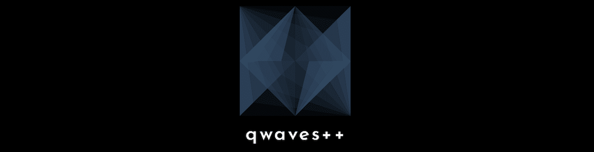

## Table of Contets
* [General Information](#general-information)
* [Dependencies](#dependencies)
* [Setup](#setup)
* [Usage](#usage)
* [Developers](#developers)

## General Information
Qwaves++ is a computationally and numerically efficient approach to determine binding energies and corresponding wave functions of a quantum-mechanical three-body problem in low dimensions. Our approach exploits the tensor structure intrinsic to the multidimensional stationary Schr\"odinger equation, which we express as a discretized eigenvalue problem. In order to obtain numerical solutions of the three-body system in one spatial dimension, we represent the Hamiltonian operator as a series of dense matrix-matrix products and propose an efficient preconditioned Jacobi-Davidson QR iteration for the resulting algebraic eigenvalue problem. This implementation allows a significantly faster computation of three-body bound states with a higher accuracy than in previous works. To investigate the feasibility of solving higher dimensional problems, we also consider cases where we make use of an efficient shared-memory parallel implementation. Our novel approach is of high relevance for investigating the universal behavior of few-body problems governed only by the particle masses, overall symmetries, and the dimensionality of space. Moreover, our results have straightforward applications in the physics of ultracold atomic gases that are nowadays widely utilized as quantum sensors.

## Dependencies
* C++20
* Phist with Trilinos
* cuBLAS or CUTLASS

## Setup
```
$ cmake ..
```

## Usage
```cpp
std::size_t N = ... ;
auto roots = qwv::discretization::roots<double>{N}
auto chebyshev = qwv::differential::Chebyshev1D<double>(roots, N);

// CUDA

```
## Developers
* Moritz Travis Hof:
     - German Aerospace Agency: High Performance Computing - Parallel Algorithms and Numerics
     - Technical University of Delft - Department of Applied Mathematics
     
* Dr. Jonas Thies:
     - Technical University of Delft - Department of Applied Mathematics
